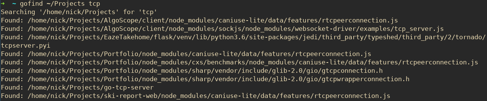

# gofind

gofind is a command line tool used to search your device for files or folders by name.



## Installation

You can download the [gofind executable here](https://github.com/n-ulricksen/gofind/releases), or build it yourself if you have [Go](https://golang.org/) installed.

### Build Using Git and Go

Clone the source code

```sh
git clone https://github.com/n-ulricksen/gofind.git
```

Build the binary

```sh
go build -o gofind .
```

## Usage

gofind will recursively search the given directory for files or folders matching the given search term.

```sh
./gofind <search directory> <search term>
```

### Examples

```sh
# absolute directory path
./gofind ~/Documents report.doc

# relative directory path
./gofind ../Projects readme
```

## Contributing

Pull requests welcome and appreciated!

## License

[MIT](https://choosealicense.com/licenses/mit/)
